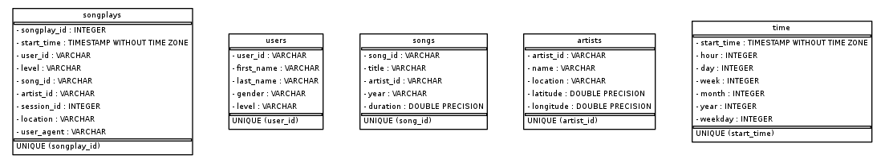

# Data Modeling with Postgres - Sparkify
## *Author: Ashwin Chidambaram*

#### **Files Included:**
##### Troubleshooting/Test Files

  - **test.ipynb**
    - Displays the first few rows of each table to let us check our database

  - **etl.ipynb**
    - Reads & processes a single file from [song_data, log_data] and loads the data into our tables

##### Production Files

  - **create_tables.py**
    - Drops and creates our tables

  - **sql_queries.py**
    - Contains all my sql queries
    - Used in both create_tables.py and etl.py

  - **etl.py**
    - Reads & processes files from [song_data, log_data] and loads the data into our tables

##### Other Files

  - **ERdiagram.py**
    - Create database schema and save as .png file (*sparkifydb_erd.png*)

-----------------------------------------

#### **About Project**

##### **Project Purpose:**
###### Problem Introduction:
A startup called Sparkify wants to analyze the data they've been collecting on songs and user activity on their new music streaming app. The analytics team is particularly interested in understanding what songs users are listening to. Currently, they don't have an easy way to query their data, which resides in a directory of JSON logs on user activity on the app, as well as a directory with JSON metadata on the songs in their app.

###### How I Contributed:
At present, all data that the company Sparkify is collecting sits in JSON files within their stored directories. With the data just sitting idle in its location, there can be no value realized from it. To rectify that problem, I built a database utilizing Postgres to store their data in easy to query tables so that it can be used as required.

For Sparkify, it is important for them to be able to organize and query data from 3 main categorizations.

  - [2] Data from their **Users**
  - [3] Data on the **Song** they offer
  - [4] Data on the **Artists** hosted on their platform

However, considering the scale of their userbase, it would be inefficient for data to only exist within those three tables, so in addition to those, we are including two more tables. One that can consolidate data from across the schema so that we can query from multiple tables as necessary [1], and one more table that will be used to note time stamp data of the when certain songs have been listened to by a user [5].

Together this results in 4 dimension tables, and 1 fact table.

  - **Fact Table:**
    - [1] - songplays

  - Dimension Tables:
    - [2] - users
    - [3] - songs
    - [4] - artists
    - [5] - time

***Entity Diagram for Sparkify***

By creating an ETL (Extract, Transformm, Load), I was able to pull data from the JSON files stored off within the Sparkify directory, and transform that data into something that could be loaded into the database schema I built. The ETL process first reads data from the songs directory, and after conversion, inserts it into the relevant fields within the *songs* and *artists* tables. Afterwards, it reads data from the log data of users, and similarly converts the data to be loaded into the relevant tables. The time data is first extracted from the user logs for each user, and is converted into a readable format since it is stored as one long numeric string at present. After conversion, this data is then loaded into the *time* table, and the remaining data is grabbed to be formatted and inserted into the *users* table. After the 4 dimension tables are loaded with their data, we take the data regarding to when a song was played and aggregate it with data from our dimension tables and load it into the *songplays* table.

-----------------------------------------
#### **Example Queries & Results**

> SELECT songs.song_id, songs.artist_id FROM songs JOIN artists ON songs.artist_id = artists.artist_id WHERE song_id is not NULL AND artists.artist_id is not NULL LIMIT 5
>> 5 rows affected.
>>>            song_id        |      artist_id
>>>       ----------------------------------------
>>>       SOMZWCG12A8C13C480  | ARD7TVE1187B99BFB1
>>>       SOUDSGM12AC9618304  | ARNTLGG11E2835DDB9
>>>       SOIAZJW12AB01853F1  | AR8ZCNI1187B9A069B
>>>       SOHKNRJ12A6701D1F8  | AR10USD1187B99F3F1
>>>       SOCIWDW12A8C13D406  | ARMJAGH1187FB546F3
